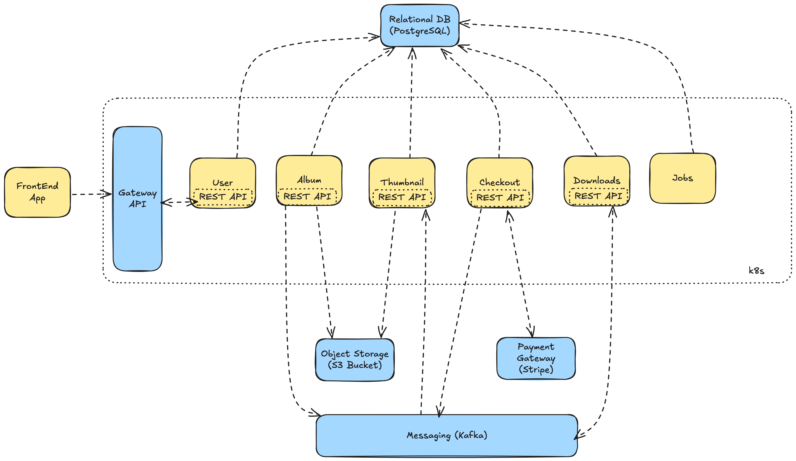
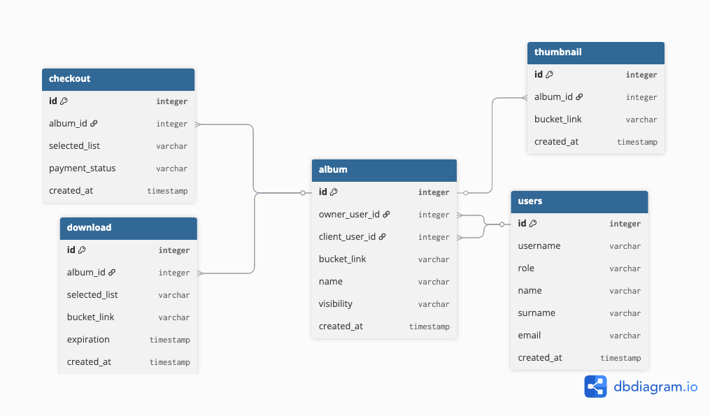

# system-design-saas
Conceptual system design for a hypothetical SaaS

# The Business

Our SaaS is a professional photo album where a photographer can upload photos into albums and sell the photos for one specific client or to the public. The client selects the desired photos for a fixed price per picture, and receives a link to download a zip file containing the purchased files.

# Microservices Architecture Proposal

## Service Decomposition

### User Service

This Service will be responsible for storing essential user data like name, surname, email, and role (Photographer/Client/Admin). For security reasons, we won't store sensitive data like credit card numbers, delegating this feature for a payment gateway.

### Album Service

This service will be responsible for managing the uploads to an object store service (like AWS S3 or Google Cloud Storage) and organizing the associated data, like the album's name, bucket folder link, visibility, owner, and client. Every time a new photo is uploaded, an event is sent to the message queue, and the message is consumed by the Thumbnail Service that creates a thumbnail image to be presented to the clients. 

### Thumbnail Service

This service is responsible for creating and managing a thumbnail for every uploaded image, decreasing the resolution, applying a watermark, and serving the link to that thumbnail.

### Jobs Service

This service will implement scheduled jobs to do operations like delete expired albums, expire purchase links, collect data to generate selling reports, and any other background operations.

### Checkout Service

This service is responsible for managing the payment status and communication with our payment gateway. The payment status is sent to the messaging system to be processed by the download service.

### Download Service

The Download service will be responsible for creating a zip file with the purchased photos and storing the generated link with an expiration date.

## Service Discovery & Communication

All the microservices will be containerized with docker and deployed in a kubernetes cluster, so the service discovery is implemented with the kubernetes _service_ objects, that can be declared in configuration artifacts and acts like a network interface that can find the application services internally by a fixed name, but redirecting the requests and doing the load balancing to each _pod_ in the cluster. One of the advantages of using Kubernetes is that it is not require the use of an external service discovery tool like _zookeeper_.

## High Level Diagram



# Database Design and Data Management

## Database Choice

The PostgreSQL relational database will be the best choice for this project. Because the data had a very predictible structure, that can be easily represented in tables and their relationships. Another advantage is the maturity, performance, stability and community of PostgreSQL. 

## Schema Design



## Scalability & Data Partitioning

The scalability can be achieved vertically and horizontally using a cloud service (like Amazon RDS, or similar), increasing the instance resources and read replicas as needed. These replicas can be created in advance and left in standby, and using monitoring, a lambda function can start the replicas as needed to optimize the costs. The data partitioning can be done if the amount of data increases in a way that affects the queries' performance, and PostgreSQL has an extension called _pg_partman_ that can create _child tables_ (partitions) that inherit structure, indexes, primary and foreign keys from the parent tables. The queries don't need to be changed, PostgreSQL will be capable of searching in the partitions, optimizing the table scan automatically.

# REST API Design

## Endpoint Design

The endpoints need to follow the right HTTP verbs for the operations (GET, PUT, POST, DELETE...) and return the right HTTP status codes for each request (2XX, 3XX, 4XX, 5XX...). All the requests need to be authenticated using JWT tokens provided by an IAM service of the chosen cloud (with OAuth2 integration). 

To achieve a good pattern, all the response messages need to follow the basic structure:

```json
{
    statusCode: 200,
    message: "OK",
    data: {
        ...   //with all entity-related data
 },
    metadata: {
        ... // with all auxiliary data like pagination, resolution, flags...
 }
}
```

Spring Boot is the chosen framework to implement the services like REST APIS, take advantage of the huge community, security, stability, performance and a rich number of modules/libraries.

## Versioning & Documentation

All endpoints need to follow the versioning in the URI, like:

```
 /v1/entity/:pathParameter?queryString=abc&...
 /v2/entity/:pathParameter?queryString=abc&...
```

The documentation can be easily implemented using the Swagger tool that has integration with Spring Boot. This choice follows the OpenAPI specification. 

## Security & Rate Limiting

The security can be provided by a series of infrastructure decisions like cluster isolation, use of SSL and HTTPS, authentication, and authorization with an IAM tool, OAuth2 and JWT tokens. In addition to that, the rate limit can be configured in an API gateway that can implement rules for each endpoint as needed. 

# Additional Considerations

## Scalability & Fault Tolerance:

Kubernetes has a lot of strategies to deal with scalability and fault tolerance. For example, the scalability can be achieved with a deployment configuration setting the number of replicas for each _pod_ (the k8s object that controls the app containers), in association with the k8s _services_ that can do the load balancing between those replicas. The fault tolerance can be achieved using automatic restarts of the containers and, in some cases, using the messaging system to retry messages that were not consumed by the target service until the container is healthy and ready.  

## Testing & Monitoring:

The tests can be automated, using _junit_ library in conjunction with _mockito_ for the unit tests and in conjunction with _testcontainers_ library to replicate cloud services locally for the integration tests. To implement e2e tests, the _Playwright_ tool can be used to automate front-end flows and scenarios. For some specific operations that run only in the backend, the libary _REST Assured_ can be used for e2e only in the backend side.

All the testing tools can be executed by a CI/CD pipeline (using Jenkins or another tool like AWS Code Build) as quality gates to avoid wrong deployments to production. 

The code review and branching development need to be implemented as a good practice, and every merge request can be approved only after passing the CI/CD quality gate and receiving approval by the reviewers (at least 2 approvals).

The observability/metrics can be implemented using cloud tools like _cloud watch_ (if AWS is chosen) or/and with external tools like _Sentry_ (for the frontend) and _Datadog_ for the backend. To create fine-grained dashboards, _Graphana_ can be used, collecting metrics and displaying customized analytical graphs as needed.

# Conclusion

This is the high-level overview to implement this SaaS, without going too deep into the proposed architecture and tech stack, but it covers the major concerns about this kind of application.
